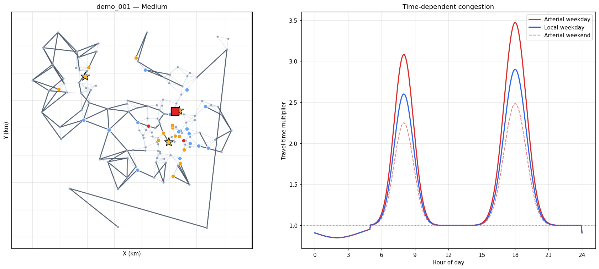
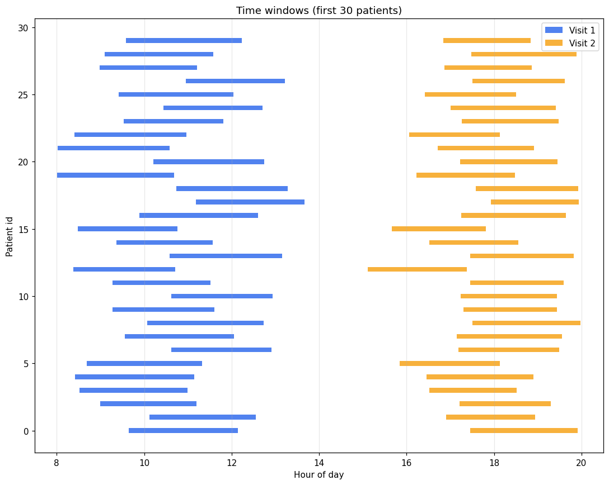
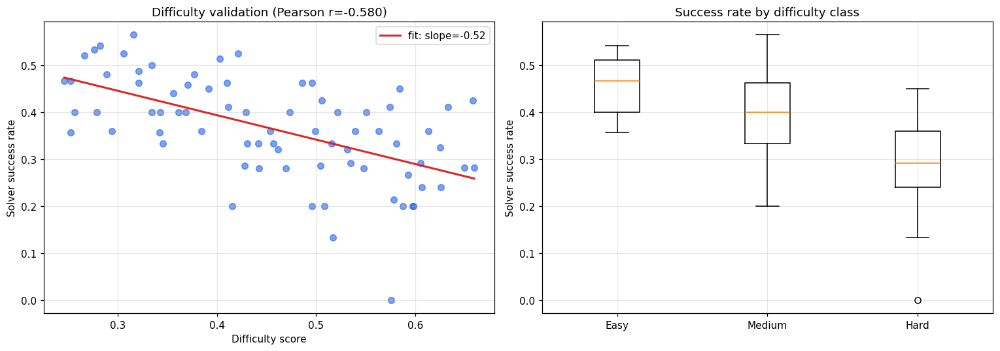
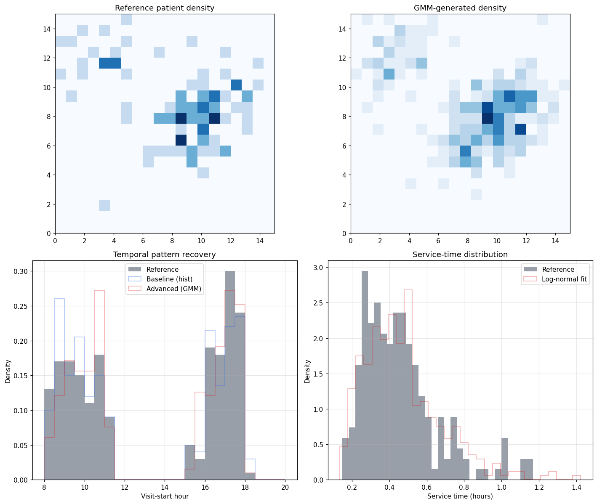
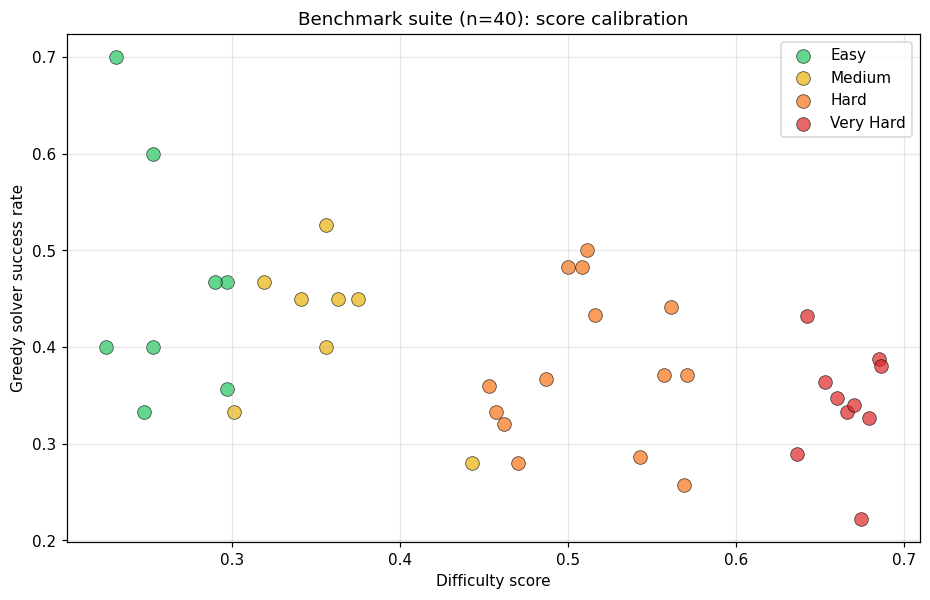

# Synthetic Data Generation for Dual-Visit Service Logistics

A synthetic-data generator for a home-healthcare routing problem combining three hard features: **time-dependent travel** (rush-hour effects), **dual visits per patient** with temporal coupling, and **time windows** with inter-visit dependencies. Outputs a standardized benchmark suite for evaluating routing algorithms.

## The problem

In home healthcare, nurses visit patients twice daily — typically a morning visit (medication, check-in) and an afternoon visit (follow-up). Each visit has its own time window. Travel times across the city change with the hour due to rush-hour traffic, and arterial roads slow down more sharply than local roads. Capacity-constrained vehicles must service all visits while respecting:

- Each patient's two separate time windows
- A minimum and maximum gap between their two visits
- A daily working window (8 AM – 8 PM)
- Time-dependent edge weights on the road network

This combination makes it harder than standard VRPTW and there is no widely available synthetic benchmark for it.

## What this project produces

- A **city generator** with urban cores, density falloff, and a two-tier road network (arterial + local)
- A **time-dependent traffic model** with Gaussian rush-hour peaks differentiated by road class and weekday/weekend
- A **patient generator** with non-uniform spatial distribution, log-normal service times, and dual-visit time windows
- A **5-component difficulty score**, empirically validated against solver success rate
- An **ML ablation** comparing GMM (BIC-selected) against KDE/histogram baselines for spatial and temporal pattern recovery
- A **standardized benchmark suite** of 40 instances in JSON + CSV, spanning Easy through Very Hard

## Time windows and dual-visit coupling

Each patient has two windows. Visit 2 is anchored to visit 1's end time plus a minimum gap, with both visits required to fit within their respective windows.

## Difficulty score validation

The difficulty score is a weighted sum of five normalized components: size, time-window tightness, dual-visit coupling, traffic exposure, and spatial dispersion.

To verify the score is meaningful, a baseline greedy solver was run on 75 instances spanning sizes 15–40 patients, tightness 0.1–0.9, and 5 seeds per configuration.

**Result:** Pearson r = **−0.580**, p = 5×10⁻⁸, Spearman ρ = −0.596. The score is a strong empirical predictor of solver difficulty.

In the final benchmark suite, mean solver success rate decreases monotonically across the four classes:

| Class | n | Mean success | Std |
|---|---|---|---|
| Easy | 8 | 46.6% | 12.6% |
| Medium | 8 | 42.0% | 7.9% |
| Hard | 14 | 37.8% | 8.0% |
| Very Hard | 10 | 34.2% | 5.7% |

Variance also tightens from Easy to Very Hard, meaning the score is most *consistent* on harder instances.

## ML pattern learning

Spatial and temporal patterns of patient distributions were learned with a **Gaussian Mixture Model** (BIC-selected component count) and compared against a baseline using k-means + KDE for spatial and histogram sampling for temporal.

| Metric | Baseline | GMM |
|---|---|---|
| Spatial sliced-Wasserstein ↓ | 0.279 | 0.283 |
| Spatial avg log-likelihood ↑ | −4.281 | **−0.045** |
| Temporal 1-D Wasserstein ↓ | 0.350 | **0.176** |

GMM gives ~100× better spatial log-likelihood and halves the temporal Wasserstein distance. The spatial sliced-Wasserstein is tied — both capture the rough density, but GMM's parametric form gives much more accurate density estimation. Log-normal service times match the reference within 3%.

## The benchmark suite

40 instances were generated spanning the full difficulty spectrum.

Each instance is exported as JSON (full fidelity) plus a global CSV manifest. Schema:

- **City**: nodes, intersection coordinates, edges with `length_km`, `base_time_hr`, `road_class`
- **Patients**: location, two service times, two windows, gap constraints, priority
- **Traffic model parameters** (peak amplitudes, road-class scaling, weekend factor)
- **Generator config** for full reproducibility

The benchmark zip is included in this repo: [`benchmark_suite.zip`](benchmark_suite.zip).

## Limitations

- The reference dataset for ML training is itself synthetic; realism against real urban mobility data remains untested
- The greedy solver used for difficulty validation is intentionally simple — stronger solvers would shift absolute success rates but should preserve the monotone trend
- Travel-time model uses the departure-hour-multiplier approximation, not fully FIFO-correct time-dependent Dijkstra
- Difficulty thresholds were calibrated *post-hoc* from the observed score distribution. The validation correlation was computed on an independent 75-instance set with the original scores, so recalibration does not contaminate the validity claim

## Future work

- Calibrate spatial/temporal models against real anonymized healthcare data
- Stronger solver baselines (CP-SAT, ALNS, metaheuristics) for tighter validation
- Online/stochastic variants with mid-day patient arrivals
- Public release on Zenodo for community reuse

## Tech stack

Python 3, NumPy, SciPy, scikit-learn (Gaussian Mixture, KDE, KMeans), NetworkX, Matplotlib, Pandas, Jupyter.
